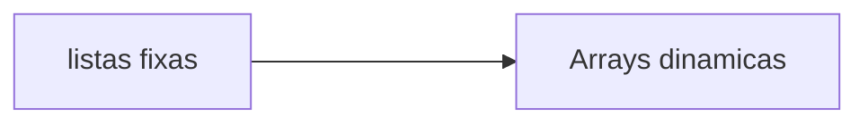

# C-arrays: Listas estaticas e listas dinamicas.



### Aluno:

- [Heitor Santos Cortes](https://github.com/heitorpcrl)

### Descrição: 

Atividade avaliativa de estrutura de dados, com tema de listas e arrays dinamicos em C.

## __Introdução as listas dinâmicas__:

As listas dinamicas sao encadeadas em um circuito que funciona com as seguintes funções: __QUEUE__ e __DEQUEUE__, sendo __queue__ a definição de quando algum valor atribuido a lista esteja em espera para ser adicionado a fila, e __dequeue__ o valor que esteja em espera para ser removido da fila. Já com valores que podem ser modificados a qualquer momento, a lista dinamica se torna mais versatil no ambiente de codificação ja que ela pode ser mudada a qualquer momento usando algumas funções que modificam a interação com os valores que serão atribuidos.

#Implementação em C

##Operações basicas

-Criação e inicialização (Padrão dinâmico):
```
#include <stdio.h>
#include <stdlib.h>

int main() {
    int* lista = NULL;  // Ponteiro para a lista (inicialmente vazio)
    int tamanho = 0;    // Tamanho atual da lista
```

-Inserção (Padrão dinâmico):

```
for (int i = 0; i < 3; i++) {
        lista = (int*)realloc(lista, (tamanho + 1) * sizeof(int));
        if (lista == NULL) {
            printf("Erro ao alocar memória!\n");
            return 1;  // Termina o programa em caso de erro
        }
        lista[tamanho] = (i + 1) * 10;  // Atribuindo os valores 10, 20, 30
        tamanho++;
    }
```
-Remoção (Padrão dinâmico):
```
int i, j;
        int encontrado = 0;

        for (i = 0; i < tamanho; i++) {
            if (lista[i] == valor) {
                encontrado = 1;
                // Desloca os elementos para a esquerda, sobrescrevendo o valor removido
                for (j = i; j < tamanho - 1; j++) {
                    lista[j] = lista[j + 1];
                }
                tamanho--;
                lista = (int*)realloc(lista, tamanho * sizeof(int));  // Redimensiona o array
                break;
            }
        }
```


## Exemplo pratico (ESTRUTURA DE UMA LISTA DINAMICA):

```
#include <stdio.h>
#include <stdlib.h>

int main() {
    int* lista = NULL;  // Ponteiro para a lista (inicialmente vazio)
    int tamanho = 0;    // Tamanho atual da lista

    // Adicionando 3 valores na lista
    for (int i = 0; i < 3; i++) {
        lista = (int*)realloc(lista, (tamanho + 1) * sizeof(int));
        if (lista == NULL) {
            printf("Erro ao alocar memória!\n");
            return 1;  // Termina o programa em caso de erro
        }
        lista[tamanho] = (i + 1) * 10;  // Atribuindo os valores 10, 20, 30
        tamanho++;
    }

    // Imprimindo a lista
    printf("Lista: ");
    for (int i = 0; i < tamanho; i++) {
        printf("%d ", lista[i]);
    }
    printf("\n");

    // Liberando a memória da lista
    free(lista);

    return 0;
}
```
## Comparação com lista estatica

A lista estatica, diferente da dinamica, ja tem valores pre fixados na indentização do codigo.

```
#include <stdio.h>

int main() {
    int lista[3];  // Definindo uma lista estática de 3 elementos
    int tamanho = 3;  // Tamanho da lista

    // Atribuindo valores à lista
    for (int i = 0; i < tamanho; i++) {
        lista[i] = (i + 1) * 10;  // Atribuindo os valores 10, 20, 30
    }

    // Imprimindo a lista
    printf("Lista: ");
    for (int i = 0; i < tamanho; i++) {
        printf("%d ", lista[i]);
    }
    printf("\n");

    return 0;
}
```

## Vantagens e Desvantagens

A desvantagem da lista dinamica é a necessidade de alocação e liberação da memoria de valores introduzidos, porem exponencialmente mais versatil que o modelo de lista estatica.

Por sua vez a lista estatica é mais simples, porém funcionando apenas em um modelo linear, com os valores pré definidos no codigo, impedindo flexibilização e mudanças futuras.

## Referencias:

- Livro: https://dokumen.pub/c-a-linguagem-de-programaao-padrao-ansi-2-ediao-0131103628-8570015860-f-6709486.html
- Site: https://pt.stackoverflow.com/search?q=listas+em+C


