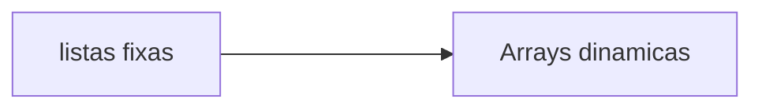

# C-arrays: Listas estaticas e listas dinamicas.



### Aluno:

- [Heitor Santos Cortes](https://github.com/heitorpcrl)

### Descrição: 

Atividade avaliativa de estrutura de dados, com tema de listas e arrays dinamicos em C.

## __Introdução as listas dinâmicas__:

As listas dinamicas sao encadeadas em um circuito que funciona com as seguintes funções: __QUEUE__ e __DEQUEUE__, sendo __queue__ a definição de quando algum valor atribuido a lista esteja em espera para ser adicionado a fila, e __dequeue__ o valor que esteja em espera para ser removido da fila.

## Exemplo pratico:

```
#include <stdio.h>
#include <stdlib.h>

int main() {
    int* lista = NULL;  // Ponteiro para a lista (inicialmente vazio)
    int tamanho = 0;    // Tamanho atual da lista

    // Adicionando 3 valores na lista
    for (int i = 0; i < 3; i++) {
        lista = (int*)realloc(lista, (tamanho + 1) * sizeof(int));
        if (lista == NULL) {
            printf("Erro ao alocar memória!\n");
            return 1;  // Termina o programa em caso de erro
        }
        lista[tamanho] = (i + 1) * 10;  // Atribuindo os valores 10, 20, 30
        tamanho++;
    }

    // Imprimindo a lista
    printf("Lista: ");
    for (int i = 0; i < tamanho; i++) {
        printf("%d ", lista[i]);
    }
    printf("\n");

    // Liberando a memória da lista
    free(lista);

    return 0;
}
```


